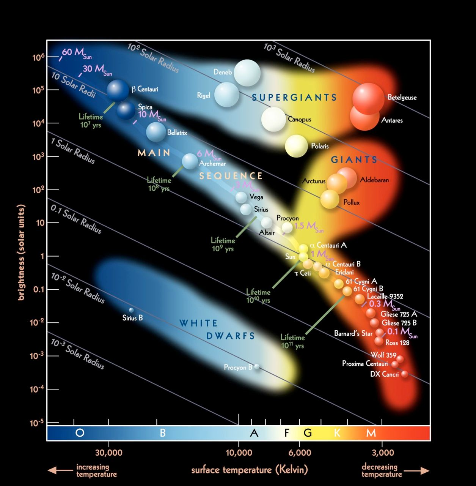
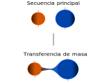
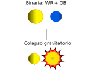
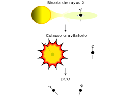
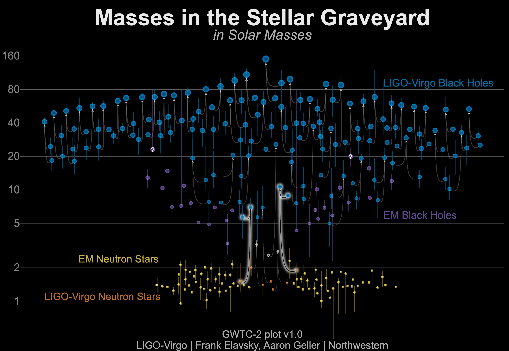

[//]: # (---)
[//]: # (Title)
[//]: # (---)
class: middle
background-image: linear-gradient(rgba(0, 0, 0, 0.6), rgba(0, 0, 0, 0.75)), url( images/bbh.svg )

.boxtitle3.noborder.fgtransparent.pushfront[
# .fsize120[.blue[**Sistemas progenitores de ondas gravitacionales**]]
]

 
 

### .center.bluelight[**Star Party**]
### .center.bluelight[2023-04-22]

 

### .center.blue[**A. Simaz Bunzel**]

 

### .center.white[Instituto Argentino de Radioastronomía (CONICET; CICPBA; UNLP)]

[//]: # (---)
[//]: # (---)
[//]: # (---)

[//]: # (---)
[//]: # (Intro)
[//]: # (---)
---
class: middle
background-image: linear-gradient(rgba(0, 0, 0, 0.6), rgba(0, 0, 0, 0.6)), url( images/bbh.svg )

[//]: # (---)
[//]: # (---)
[//]: # (---)

[//]: # (---)
[//]: # (Binary system: definition)
[//]: # (---)
---
class: middle
background-image: linear-gradient(rgba(0, 0, 0, 0.9), rgba(0, 0, 0, 0.9)), url( images/interacting_binary.svg )

.boxtitle3.noborder.fgtransparent.pushfront[
# .fsize120[.blue[**¿Qué es un sistema binario?**]]
]

[//]: # (---)
[//]: # (---)
[//]: # (---)

[//]: # (---)
[//]: # (Binary system: definition - 2)
[//]: # (---)
---
class: middle
background-image: linear-gradient(rgba(0, 0, 0, 0.9), rgba(0, 0, 0, 0.9)), url( images/interacting_binary.svg )

.boxtitle3.noborder.fgtransparent.pushfront[
# .fsize120[.blue[**Par de estrellas ligadas gravitacionalmente de manera que, en algún momento de su evolución, intercambiarán:**]]
]
.boxtitle3.noborder.fgtransparent.pushfront[
# .fsize120[.white[*- Transferencia de masa*]]
]
.boxtitle3.noborder.fgtransparent.pushfront[
# .fsize120[.blue[*- Momento angular*]]
]

[//]: # (---)
[//]: # (---)
[//]: # (---)

[//]: # (---)
[//]: # (Binary system: definition - 2)
[//]: # (---)
---
class: middle
background-image: linear-gradient(rgba(0, 0, 0, 0.9), rgba(0, 0, 0, 0.9)), url( images/interacting_binary.svg )

.boxtitle3.noborder.fgtransparent.pushfront[
# .fsize120[.blue[**Diagrama HR**]]
]

[//]: # (---)
[//]: # (---)
[//]: # (---)

[//]: # (---)
[//]: # (Binary system: definition - 2)
[//]: # (---)
---
class: middle
background-color: black

.center[.figplaint-maxh700.noborder[]]

[//]: # (---)
[//]: # (---)
[//]: # (---)

[//]: # (---)
[//]: # (Binary system: evolutionary path)
[//]: # (---)
---
class: middle
background-image: linear-gradient(rgba(0, 0, 0, 0.9), rgba(0, 0, 0, 0.9)), url( images/interacting_binary.svg )

.boxtitle3.noborder.fgtransparent.pushfront[
# .fsize120[.blue[**Camino evolutivo**]]
]

[//]: # (---)
[//]: # (---)
[//]: # (---)

[//]: # (---)
[//]: # (Binary system: evolutionary path - two stars - 1)
[//]: # (---)
---
class: middle
background-image: linear-gradient(rgba(0, 0, 0, 0.9), rgba(0, 0, 0, 0.9)), url( images/interacting_binary.svg )

.boxtitle3.noborder.fgtransparent.pushfront[
# .fsize120[.blue[**Evolución de dos estrellas**]]
]
[//]: # (---)
[//]: # (---)
[//]: # (---)

[//]: # (---)
[//]: # (Binary evolution: evolutionary path - two stars - 2)
[//]: # (---)
---
class: center nopadding middle split-30

.column_bt2[
.pushfront.vmiddle[
## .blue[Primera parte]

### .white[Etapas principales]
]]

.column_t2.pushfront[.vmiddle.nopadding[
.boxtitle3.noborder[
.center[.figplaint-maxh700.noborder[]]

]]
]

[//]: # (---)
[//]: # (---)
[//]: # (---)

[//]: # (---)
[//]: # (Binary evolution: evolutionary path - two stars - 3)
[//]: # (---)
---
class: center nopadding middle split-30

.column_bt2[
.pushfront.vmiddle[
## .blue[Primera parte]

### .white[Etapas principales]
]]

.column_t2.pushfront[.vmiddle.nopadding[
.boxtitle3.noborder[
.center[.figplaint-maxh700.noborder[]]

]]
]

[//]: # (---)
[//]: # (---)
[//]: # (---)

[//]: # (---)
[//]: # (Binary system: evolutionary path - two stars - video)
[//]: # (---)

---
class: middle
background-color: black

<video width="100%" height="100%" autoplay controls loop>
    <source src="video/0001-0250.mp4" type="video/mp4">
</video>

[//]: # (---)
[//]: # (---)
[//]: # (---)

[//]: # (---)
[//]: # (Intro)
[//]: # (---)
---
class: middle
background-image: linear-gradient(rgba(0, 0, 0, 0.0), rgba(0, 0, 0, 0.0)), url( images/eta-car.svg )

[//]: # (---)
[//]: # (---)
[//]: # (---)

[//]: # (---)
[//]: # (Intro)
[//]: # (---)
---
class: middle
background-image: linear-gradient(rgba(0, 0, 0, 0.9), rgba(0, 0, 0, 0.9)), url( images/supernova.jpg )

.boxtitle3.noborder.fgtransparent.pushfront[
# .fsize120[.blue[**Formación del objeto compacto**]]
]
[//]: # (---)
[//]: # (---)
[//]: # (---)

[//]: # (---)
[//]: # (Intro)
[//]: # (---)
---
class: middle
background-image: linear-gradient(rgba(0, 0, 0, 0.0), rgba(0, 0, 0, 0.0)), url( images/sn2016gkg.svg )

[//]: # (---)
[//]: # (---)
[//]: # (---)
[//]: # (---)

[//]: # (---)
[//]: # (Intro)
[//]: # (---)
---
class: middle
background-image: linear-gradient(rgba(0, 0, 0, 0.1), rgba(0, 0, 0, 0.1)), url( images/nsbh.svg )

[//]: # (---)
[//]: # (---)
[//]: # (---)

[//]: # (---)
[//]: # (Intro)
[//]: # (---)
---
class: middle
background-image: linear-gradient(rgba(0, 0, 0, 0.0), rgba(0, 0, 0, 0.0)), url( images/betelgeuse.svg )

[//]: # (---)
[//]: # (---)
[//]: # (---)

[//]: # (---)
[//]: # (Intro)
[//]: # (---)
---
class: center nopadding middle split-30

.column_bt2[
.pushfront.vmiddle[
## .blue[Segunda parte]

### .white[Etapas principales]
]]

.column_t2.pushfront[.vmiddle.nopadding[
.boxtitle3.noborder[
.center[.figplaint-maxh700.noborder[]]

]]
]
[//]: # (---)
[//]: # (---)
[//]: # (---)

[//]: # (---)
[//]: # (Intro)
[//]: # (---)
---
class: middle
background-image: linear-gradient(rgba(0, 0, 0, 0.9), rgba(0, 0, 0, 0.9)), url( images/magnetar.jpg )

.boxtitle3.noborder.fgtransparent.pushfront[
# .fsize120[.blue[**Evolución durante la etapa de binaria de rayos X**]]
]
[//]: # (---)
[//]: # (---)
[//]: # (---)

[//]: # (---)
[//]: # (Intro)
[//]: # (---)
---
class: middle
background-color: black
background-image: linear-gradient(rgba(0, 0, 0, 0.0), rgba(0, 0, 0, 0.0)), url( images/gx301-2.svg )

[//]: # (---)
[//]: # (---)
[//]: # (---)

[//]: # (---)
[//]: # (Intro)
[//]: # (---)
---
class: middle
background-image: linear-gradient(rgba(0, 0, 0, 0.0), rgba(0, 0, 0, 0.0)), url( images/hmxb-catalog.svg )

[//]: # (---)
[//]: # (---)
[//]: # (---)

[//]: # (---)
[//]: # (Intro)
[//]: # (---)
---
class: middle
background-image: linear-gradient(rgba(0, 0, 0, 0.6), rgba(0, 0, 0, 0.75)), url( images/bbh.svg )

.boxtitle3.noborder.fgtransparent.pushfront[
# .fsize120[.blue[**Formación del sistema binario de objetos compactos**]]
]

[//]: # (---)
[//]: # (---)
[//]: # (---)

[//]: # (---)
[//]: # (Intro)
[//]: # (---)
---
class: middle
background-color: black

<video width="100%" height="100%" autoplay controls loop>
    <source src="video/bbh.mp4" type="video/mp4">
</video>

[//]: # (---)
[//]: # (---)
[//]: # (---)

[//]: # (---)
[//]: # (Intro)
[//]: # (---)
---
class: middle
background-color: black

.nopadding[
.boxtitle3.noborder[
.center[.figplaint-maxh500.noborder[]]

]]
[//]: # (---)
[//]: # (---)
[//]: # (---)

[//]: # (---)
[//]: # (Intro)
[//]: # (---)
---
class: middle
background-color: black

.boxtitle3.noborder.fgtransparent.pushfront[
# .fsize120[.blue[**Y se los puede oír !**]]
]

[//]: # (---)
[//]: # (---)
[//]: # (---)

[//]: # (---)
[//]: # (Intro)
[//]: # (---)
---
class: middle
background-color: black

.boxtitle3.noborder.fgtransparent.pushfront[
## .fsize120[.white[*Formas de onda sin multipolos*]]
 
<audio controls>
  <source src="./audio/no-higer-order-multipoles.wav" type = "audio/wav" />
</audio>
 
]

.boxtitle3.noborder.fgtransparent.pushfront[
## .fsize120[.blue[*Formas de onda con multipolos*]]
 
<audio controls>
  <source src="./audio/higer-order-multipoles.wav" type = "audio/wav" />
</audio>
 
]

[//]: # (---)
[//]: # (---)
[//]: # (---)

[//]: # (---)
[//]: # (Intro)
[//]: # (---)
---
class: middle
background-color: black

.boxtitle3.noborder.fgtransparent.pushfront[
# .fsize120[.blue[**Todos los datos de esta charla se encuentran en:**]]
 
### .fsize120[.white[**https://github.com/asimazbunzel/starparty2023**]]
 
# .fsize120[.blue[**Para que lo use quien quiera !**]]
 
 

### .white[contacto: asimazbunzel@iar.unlp.edu.ar]
]
